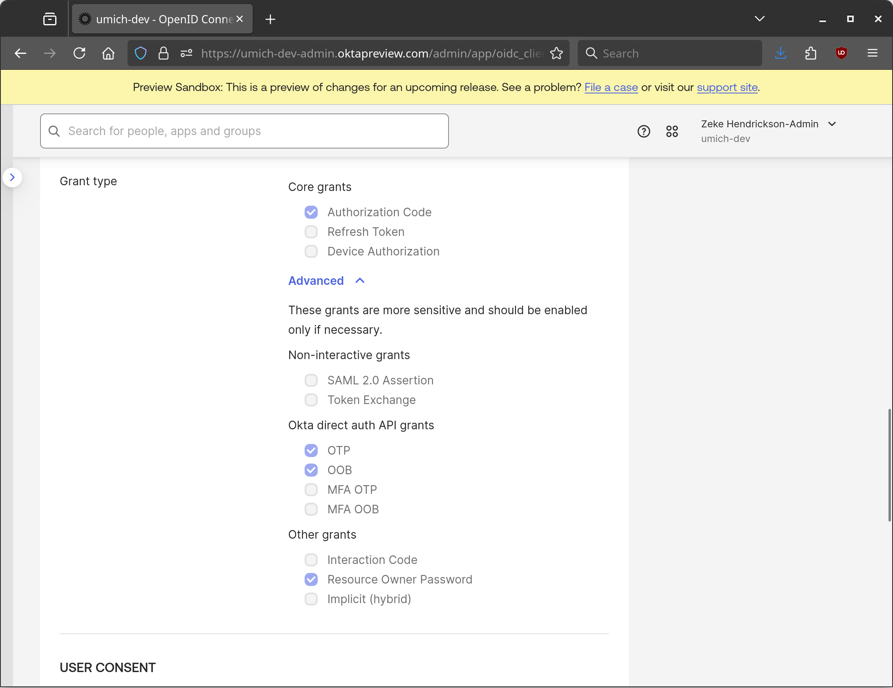
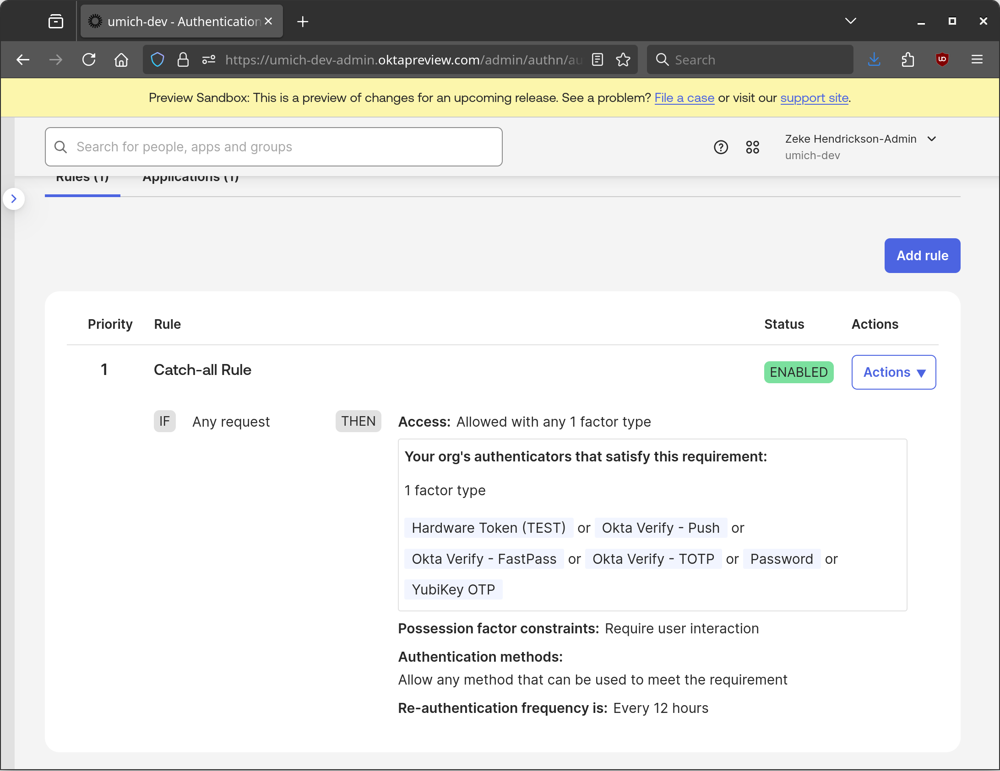

# pam_okta_auth

[](https://github.com/flowerysong/pam_okta_auth/actions/workflows/build.yml)

Okta authentication for Unix systems.


pam_okta_auth is a Pluggable Authentication Modules (PAM)
module designed to provide secondary authentication similar to
[duo_unix](https://github.com/duosecurity/duo_unix) using Okta.
It also has experimental support for password-based primary
authentication.

## Deployment

The configuration file, normally located at
`/etc/security/pam_okta_auth.toml`, uses the [TOML](https://toml.io/)
format. This file contains secrets, so it must not be world readable.

Supported configuration file options and PAM options are documented
in the [man page](doc/pam_okta_auth.8.md).

Okta client credentials are required; these should be for a native
application with at least the `OTP` and `OOB` direct auth grants.



The application must also be assigned an authentication policy that permits
authentication with a single factor.



### Example Config File

```toml
host = "example.oktapreview.com"
client_id = "0deadgoffdeADGOffick"
client_secret = "6zFfFfffzfZFz6zFZFzzFZFZFfZf6Fz6F6ZfZ6f-FFFzZZ6FZ_zZFzFZ6fFzfFFz"
```

### Example PAM config

```
auth       required     pam_okta_auth.so
```
